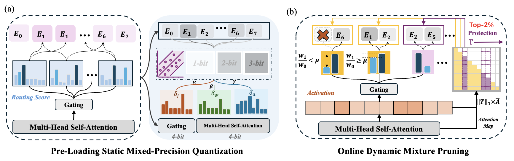

<p align="center" width="10%">
 
</p>

# MC-MoE: Mixture Compressor for Mixture-of-Experts LLMs Gains More

[Wei Huang](https://aaron-weihuang.com/), [Yue Liao](https://scholar.google.com/citations?user=mIt-3fEAAAAJ&hl=en), [Jianhui Liu](https://scholar.google.com/citations?user=n1JW-jYAAAAJ&hl=en), [Ruifei He](https://scholar.google.com/citations?user=P7IL0hkAAAAJ), [Haoru Tan](), [Shiming Zhang](), [Hongsheng Li](https://scholar.google.com/citations?user=BN2Ze-QAAAAJ&hl=zh-CN), [Si Liu](https://scholar.google.com/citations?user=-QtVtNEAAAAJ&hl=en) and [Xiaojuan Qi*](https://scholar.google.com/citations?user=bGn0uacAAAAJ&hl=en) (* coresponding author)

[](https://arxiv.org/abs/2410.06270)




Extreme compression of Mixture-of-Experts Large Language Models. The current release supports:

- MC-MoE for accurate weight-only quantization (Weight=**1.5～2.5bit**).
- MC-MoE for efficient online dynamic pruning (additional compression ratio **> 10%**)
- Support pre-trained MoE-LLM (currently only support **Mixtral 8$\times$7b** and **Mixtral 8$\times$22b**)
- Real deployment and dequantization process is built on `HQQ` and `GPTQ` for vanilla group-wise quantization. MC-MoE's static quantization can also be transfered to other type of technique, such as Vector Quantization (codebook).

## Install
```sh
conda create -n mcmoe python=3.10 -y
conda activate mcmoe
git clone https://github.com/Aaronhuang-778/MC-MoE
cd MC-MoE
pip install --upgrade pip 
pip install -r requirements.txt
```

For real quantization and deployment of compressed model, we utilize [HQQ](https://github.com/mobiusml/hqq) to dequant the MoE LLMs with 1/2/3-bits. We changed the storage and dequantization process of 1-bit weights in HQQ. 

Please make sure you have a Pytorch 2 version that matches your CUDA version: https://pytorch.org/.

## Experts Precision Zoo
We provide the solved bit-width for each expert of **Mixtral 8$\times$7b** in `./experts_mixture_bit_selection/`. You can directly use our provided results or generate them by your self.

## Usage

**Quickly get the compressed model `./scripts/quant.sh`**. We have already provided all the needed middle results of **Mixtral 8$\times$7b** in this code.

```sh
# Replace the path with yours, for example:
Model_Path="/mnt/models/mistralai/Mixtral-8x7B-v0.1"
Saving_Path="/mnt/models/mistralai/Mixtral-8x7B-v0.1-2.5b"
Precision_Path="./experts_mixture_bit_selection/experts_mixture_bitwidth_combination_20bit.pkl"
python main.py ${Model_Path} --wbits 2bit --attn_bits 4bit --dataset wikitext2 --groupsize 128 --eval_ppl --mixed_type mixed --precisions ${Precision_Path} --pack --save --saving_path ${Saving_Path}

```

Efficient Inference with **Pre-Loading MixedPrecision Quantization** and **Online Dynamic Pruning** : This example shows the demo of 2.5bit  Mixtral-8x7B model, the total static GPU memory consumption is around **16GB**, and the running memory is around **19GB** .

```python
import os
import torch
from transformers import AutoTokenizer
from inference import load_quantized_model
from expert_weight import  replace_with_dynamic_rank
os.environ["CUDA_VISIBLE_DEVICES"] = "0"
torch.cuda.is_available()


kwargs = {"device_map": 'auto',
          "torch_dtype": "torch.float16"}
######## Input your save_dir of quantized model########
save_dir = "/mnt/models/mistralai/Mixtral-8x7B-v0.1-2.5bit"
model = load_quantized_model(save_dir, kwargs)

######### Choose if you want to use dynamic pruning or not ##########
args = None
model = replace_with_dynamic_rank(model, args, block_range=10)
######### Choose if you want to use dynamic pruning or not ##########

tokenizer = AutoTokenizer.from_pretrained(save_dir)
prompt = "You are a writer. Please write a short story about two llamas in a forest"
prompt_template=f'''{prompt}
'''

inputs = tokenizer(prompt_template, return_tensors="pt")
device = "cuda:0" if torch.cuda.is_available() else "cpu"
inputs.input_ids = inputs.input_ids.to(device)

inputs.attention_mask = inputs.attention_mask.to(device)
# Generate
outputs = model.generate(inputs.input_ids, 
                        max_new_tokens=512,
                        pad_token_id=tokenizer.eos_token_id,
                        repetition_penalty=1.1,
                        )

print(tokenizer.decode(outputs[0]))
```


**Detailed process of MC-MOE**. 

1. First, we need to generate the expert factors for bit-width allocation in each MoE block:

   Download first part of the C4 training data `c4-train.00000-of-01024.json` from [allenai/c4](https://huggingface.co/datasets/allenai/c4/blob/main/en/c4-train.00000-of-01024.json.gz). Please save it at `./data`  and organize the datasets as follows: 
```
./data
|-- build.py
|-- c4-train.00000-of-01024.json
|-- dataset.py
|-- math_calib_construction.py
`-- math_pretrain_style.json
```
Run the  `./scripts/factors.sh` to generate the `activated frequencies`, `activated weights`   and `quantization loss` of each experts.

```sh
# Please run this script in ./scripts/factors.sh

# Your local model path
Model_Path=""
python awareness.py ${Model_Path} --calibration c4

# for example:
Model_Path="/mnt/models/mistralai/Mixtral-8x7B-v0.1"
python awareness.py ${Model_Path} --calibration c4

```
You can also change the `--calibration` data to `math` to make the calibration for specific knowledge and task. We have already provided the factors file from `c4` data set, please check:

```
|-- experts_act_frequency.pkl
|-- experts_act_weight.pkl
|-- experts_quant_loss.pkl
```

2. Second, we use the factors to solve the bit-width allocation problem through `precision_solver.py` (please generate the previous factor files before run the bit-width allocation code):

```sh
python precision_solver.py
```

This solver will save the optimal configurations of experts in each MoE block:

```sh
./experts_mixture_bit_selection
|-- experts_mixture_bitwidth_combination_12bit.pkl
|-- experts_mixture_bitwidth_combination_13bit.pkl
|-- experts_mixture_bitwidth_combination_14bit.pkl
|-- experts_mixture_bitwidth_combination_15bit.pkl
|-- experts_mixture_bitwidth_combination_16bit.pkl
|-- experts_mixture_bitwidth_combination_17bit.pkl
|-- experts_mixture_bitwidth_combination_18bit.pkl
|-- experts_mixture_bitwidth_combination_19bit.pkl
|-- experts_mixture_bitwidth_combination_20bit.pkl

# 12 bit means the total bit-width of 8 experts in one MoE block, the average bit-width of experts is 12/8=1.5bit.
```

3. Third, we can run the quantization code to compress the static parameters of MoE LLMs:

Run the  `./scripts/quant.sh` to quantize the MoE LLMs and test the perplexity results.

```sh
# Your local model path
Model_Path=""
# Expected experts precisions file
Precision_Path=""
##### fake quantization to test the performance of MC-MoE #####
python main.py ${Model_Path} --wbits 2bit --attn_bits 4bit --dataset wikitext2 --groupsize 128 --eval_ppl --mixed_type mixed --precisions ${Precision_Path}

# for example:
Model_Path="/mnt/models/mistralai/Mixtral-8x7B-v0.1"
Precision_Path="./experts_mixture_bit_selection/experts_mixture_bitwidth_combination_16bit.pkl"
python main.py ${Model_Path} --wbits 2bit --attn_bits 4bit --dataset wikitext2 --groupsize 128 --eval_ppl --mixed_type mixed --precisions ${Precision_Path}

```

add `--pach` and `--save` to save the real quantized model :

```sh
# Your local model path
Model_Path=""
# Your expected saving path
Saving_Path=""
# Expected experts precisions file
Precision_Path=""

##### real quantization and model pack for compact storage #####
python main.py ${Model_Path} --wbits 2bit --attn_bits 4bit --dataset wikitext2 --groupsize 128 --eval_ppl --mixed_type mixed --precisions ${Precision_Path} --pack --save --saving_path ${Saving_Path}

# for example:
Model_Path="/mnt/models/mistralai/Mixtral-8x7B-v0.1"
Saving_Path="/mnt/models/mistralai/Mixtral-8x7B-v0.1-2.05bit"
Precision_Path="./experts_mixture_bit_selection/experts_mixture_bitwidth_combination_16bit.pkl"
python main.py ${Model_Path} --wbits 2bit --attn_bits 4bit --dataset wikitext2 --groupsize 128 --eval_ppl --mixed_type mixed --precisions ${Precision_Path} --pack --save --saving_path ${Saving_Path}

```

4. Finally, you can load the quantized MoE LLMs and enable dynamic pruning inference with our provided inference demo:

```sh
python inference_demo.py
```


where you can also choose whether to enable dynamic pruning to improve inference efficiency  (line `17~18`)：

```python
from expert_weight import  replace_with_dynamic_rank
args = None
model = replace_with_dynamic_rank(model, args, block_range=10)
```
Detailed inference demo:

```python
import os
import torch
from transformers import AutoTokenizer
from inference import load_quantized_model
from expert_weight import  replace_with_dynamic_rank
os.environ["CUDA_VISIBLE_DEVICES"] = "0"
torch.cuda.is_available()


kwargs = {"device_map": 'auto',
          "torch_dtype": "torch.float16"}
######## Input your save_dir of quantized model########
save_dir = "/mnt/models/mistralai/Mixtral-8x7B-v0.1-2.5bit"
model = load_quantized_model(save_dir, kwargs)

######### Choose if you want to use dynamic pruning or not ##########
args = None
model = replace_with_dynamic_rank(model, args, block_range=10)
######### Choose if you want to use dynamic pruning or not ##########

tokenizer = AutoTokenizer.from_pretrained(save_dir)
prompt = "You are a writer. Please write a short story about two llamas in a forest"
prompt_template=f'''{prompt}
'''

inputs = tokenizer(prompt_template, return_tensors="pt")
device = "cuda:0" if torch.cuda.is_available() else "cpu"
inputs.input_ids = inputs.input_ids.to(device)

inputs.attention_mask = inputs.attention_mask.to(device)
# Generate
outputs = model.generate(inputs.input_ids, 
                        max_new_tokens=512,
                        pad_token_id=tokenizer.eos_token_id,
                        repetition_penalty=1.1,
                        )

print(tokenizer.decode(outputs[0]))
```


## Evaluation


We use the [EleutherAI LM Harness](https://github.com/EleutherAI/lm-evaluation-harness/tree/2a47159caff00135b026f724ace2a2011f3c7621) (commit 2a47159) framework to evaluate the performance of fake quantized MoE LLMs. The command we use for LM Harness evaluation is as follows:

```sh
# accelerate launch \
#     --num_processes=1 \
#     --ipex \
#     -m lm_eval --model hf \
#     --model_args pretrained=model_path,dtype=float16,parallelize=True \
#     --tasks piqa,boolq,arc_challenge,arc_easy,hellaswag,winogrande,mmlu,mathqa \
#     --batch_size 32 \
```


## Related Project

[OmniQuant: Omnidirectionally Calibrated Quantization for Large Language Models](https://github.com/OpenGVLab/OmniQuant)

[GPTQ: Accurate Post-training Compression for Generative Pretrained Transformers](https://github.com/IST-DASLab/gptq)

[SliM-LLM: Salience-Driven Mixed-Precision Quantization for Large Language Models](https://github.com/Aaronhuang-778/SliM-LLM)

[Not All Experts are Equal: Efficient Expert Pruning and Skipping for Mixture-of-Experts Large Language Models](https://github.com/Lucky-Lance/Expert_Sparsity)

[Examining Post-Training Quantization for Mixture-of-Experts: A Benchmark](https://github.com/UNITES-Lab/moe-quantization)

[Half-Quadratic Quantization (HQQ)](https://github.com/mobiusml/hqq)

